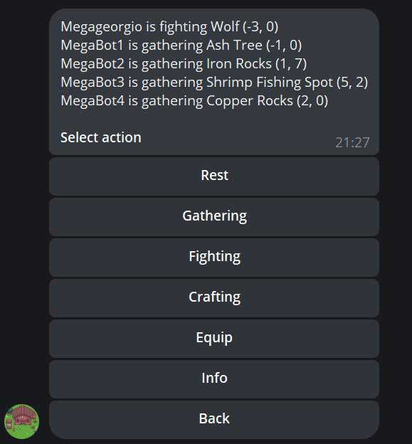

# Artifacts MMO - Telegram Bot Client

Based on: [artifactsmmo-kotlin-starter](https://github.com/Cybermaxke/artifactsmmo-kotlin-starter "artifactsmmo-kotlin-starter")

## Features
- Market, bank, character info
- Gathering (show resource only if you can gather it)
- Fighting (show monster only if you win)
- Crafting (show item only if you can craft it, and have enough materials)
- Equip items

## Notes
- You need to fill tokens in config.json file
- Code quality is pretty bad please don't check it